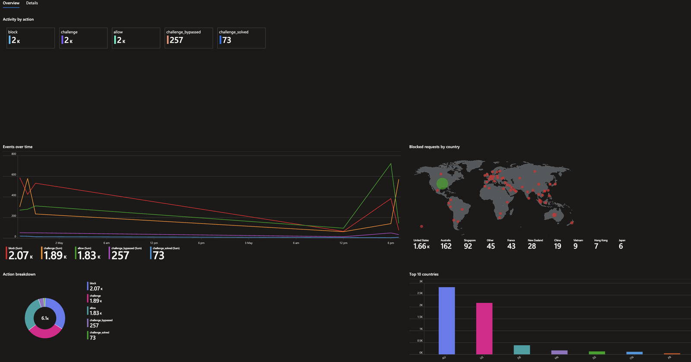
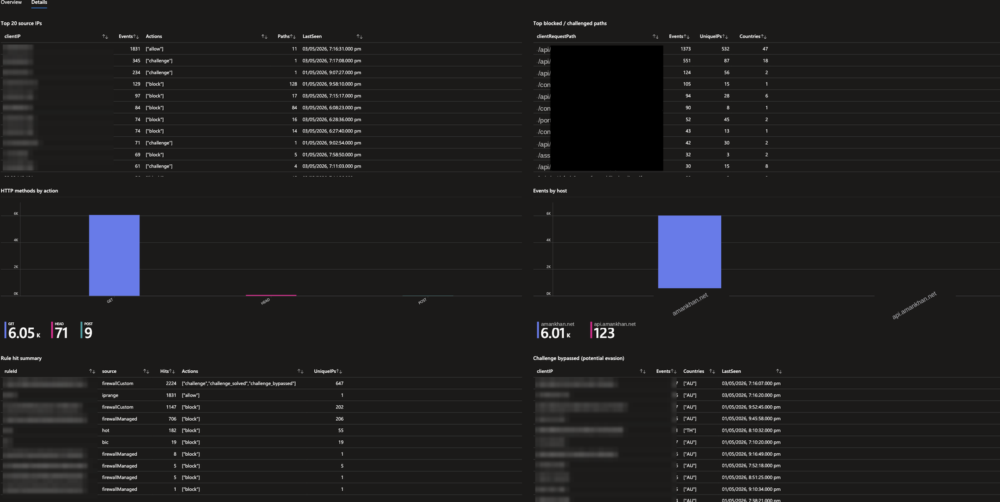

# Cloudflare Firewall Events → Microsoft Sentinel (CCF Connector)

A Codeless Connector Framework (CCF) data connector that pulls Cloudflare 
`firewallEventsAdaptive` logs into Microsoft Sentinel via the Cloudflare 
GraphQL Analytics API. Built using Microsoft Sentinel's modern V2 CCF, 
deployed via ARM templates with no Azure Functions or custom code required.

## GraphQl Limitations ##
Please note that the GraphQL API has inherent limitations, and this solution is not designed to replace Cloudflare’s recommended Logpush mechanism. Refer to the GraphQL API limitations for further details.
[GraphQl Limitation ]("https://developers.cloudflare.com/analytics/graphql-api/limits/")

## What this connector does

- Polls `https://api.cloudflare.com/client/v4/graphql` on a configurable 
  interval (default: 1 minute)
- Queries the `firewallEventsAdaptive` GraphQL dataset for a single Cloudflare zone
- Ingests up to 1000 events per poll into a custom Log Analytics table
- Captures: action, client IP, country, request host/method/path, rule ID, 
  ray name, source, and user agent

## Architecture


- Firewall event data is pulled from the Cloudflare GraphQL API.
- CCF REST API Poller queries the GraphQL API at regular intervals (every 1 minute)
- The collected data is sent to Azure, where a Data Collection Rule applies KQL-based transformations to map and normalize fields.
- The transformed data is ingested into a custom Log Analytics table, making it available in Microsoft Sentinel for querying, analysis, and alerting.
## Repository structure

```
.
├── README.md                              ← this file
├── LICENSE                                ← MIT license
├── infrastructure/
│   └── dcr-and-table.json 
                ← DCR + custom table (deploy first)
├── workbook/
│   ├── cloudflare-firewall-workbook.json
│   ├── cloudflare-firewall-workbook-gallery.json
│   └── screenshots/                
├── connector/
│   └── connector.json                     ← CCF connector definition + poller
└── docs/
    ├── DEPLOY.md                          ← step-by-step deployment guide
    ├── TROUBLESHOOTING.md                 ← common issues and fixes
    └── ARCHITECTURE.md                    ← design notes and known limitations
```

## Quick start

### Prerequisites

- Microsoft Sentinel enabled Log Analytics workspace
- Existing Data Collection Endpoint (DCE) in the same region as the workspace
- Cloudflare API Token with `Account Analytics:Read` and `Zone Analytics:Read` permissions
- Your Cloudflare Zone ID (from the Cloudflare dashboard → domain Overview page)

### Deployment (two steps)

**Step 1 : Deploy the infrastructure (DCR + custom table)**

```
Azure Portal → Deploy a custom template → Build your own template in the editor
→ paste  or upload infrastructure/dcr-and-table.json → fill parameters → Create
```

After deployment, note the DCR's **Immutable ID** from its Overview page.

**Step 2 : Deploy the connector**

```
Azure Portal → Deploy a custom template → Build your own template in the editor
→ paste or upload connector/connector.json → fill parameters → Create
```

Required parameters:

| Parameter                       | Example                                                  |
|---------------------------------|----------------------------------------------------------|
| `workspaceName`                 | `<YOUR_WORKSPACE_NAME>`                                  |
| `cloudflareApiToken`            | (paste — masked input, SecureString)                     |
| `zoneTag`                       | `<YOUR_CLOUDFLARE_ZONE_ID>`                       |
| `dataCollectionEndpoint`        | `https://<YOUR_DCE>.<REGION>.ingest.monitor.azure.com`    |
| `dataCollectionRuleImmutableId` | `dcr-<YOUR_32_HEX_DCR_IMMUTABLE_ID>`                  |

For full deployment instructions, see [docs/DEPLOY.md](docs/DEPLOY.md).

### Validate

After deploying, allow up to 30 minutes for the first batch of events:

```kusto
cloudflarefirewall_CL
| where TimeGenerated > ago(30m)
| sort by TimeGenerated desc
| take 10
```

## Pagination & data loss

This connector uses **time-windowed polling** with `limit: 1000` per call. 
For most zones this is gap-free, failed polls are re-attempted in the next 
window without data loss.

If your zone has bursty traffic (>1000 events per polling window), older 
events in that window are dropped because the query orders by `datetime_DESC`. 
Detect this with:

```kusto
cloudflarefirewall_CL
| where TimeGenerated > ago(7d)
| summarize EventCount = count() by bin(TimeGenerated, 1m)
| where EventCount >= 1000
```

If this returns rows, reduce `queryWindowInMin` further (e.g. to 30 seconds 
won't work , 1 is the minimum, so split into multiple connectors per zone 
segment, or implement cursor-based pagination. see ARCHITECTURE.md).

## Important architectural note

This connector uses the **deploy-time credential pattern**: the Cloudflare 
API Token and Zone ID are supplied as ARM parameters when the template is 
deployed. The Sentinel "Connect" UI form (with input fields for credentials) 
is reserved for Microsoft Content Hub solutions and is not available for 
custom community-built CCF connectors at the time of this writing.

The API Token parameter is a **SecureString** Azure masks it in the deploy 
form, never logs it, and never persists it in saved templates. The deployed 
JSON file is safe to commit to public Git repositories.

To rotate the API token or change the zone, simply redeploy the connector 
template with the new values. ARM updates the existing resources in place.

## Troubleshooting

See [docs/TROUBLESHOOTING.md](docs/TROUBLESHOOTING.md) for the full 
diagnostic flow. Common issues:

- **"Connectivity check failed (400)"** : usually wrong API token, wrong 
  Zone ID, or the token lacks Analytics permissions
- **"Connector deployed but no data after 30 min"** : most often a 
  stream-name mismatch between the connector and the DCR, or a region 
  mismatch between workspace/DCE/DCR
- **DCR transform errors** : enable SentinelHealth logging to surface them

## Deleting Connector##
User Azure CLI to remove the resources e.g:

```
az rest --method delete \
  --uri "https://management.azure.com/subscriptions/<SUBSCRIPTION_ID>/resourceGroups/<RESOURCE_GROUP>/providers/Microsoft.OperationalInsights/workspaces/<WORKSPACE_NAME>/providers/Microsoft.SecurityInsights/dataConnectors/<DATA_POLLER_NAME>?api-version=2024-09-01"
```


```
az rest --method delete \
  --uri "https://management.azure.com/subscriptions/<SUBSCRIPTION_ID>/resourceGroups/<RESOURCE_GROUP>/providers/Microsoft.OperationalInsights/workspaces/<WORKSPACE_NAME>/providers/Microsoft.SecurityInsights/dataConnectorDefinitions/<CONNECTOR_NAME>?api-version=2024-09-01"
  ``` 


## Workbook

A companion Sentinel workbook built on top of the `cloudflarefirewall_CL` table. It gives you a two-tab dashboard instead of writing the same KQL by hand every time.

**Overview** fits on one screen: action tiles, events over time, a geo map of blocked requests by country, action breakdown, and top 10 countries.

**Details** has the deeper material: top source IPs, top blocked/challenged paths, HTTP methods, events by host, rule hit summary, a challenge-bypassed table for spotting evasion, and the raw event log.





Full write-up: [amankhan.net](https://amankhan.net) (https://amankhan.net/posts/Cloudflare-CCF-Connector-Workbook).

### Deploying the workbook

Same two options as the connector and infrastructure above.

**Gallery import** — Sentinel → Workbooks → New → Advanced Editor → paste the contents of `workbook/cloudflare-firewall-workbook-gallery.json` → Apply → Save.

**ARM template**

```
az deployment group create \
  --resource-group <your-rg> \
  --template-file workbook/cloudflare-firewall-workbook.json
```

The queries assume your table is named `cloudflarefirewall_CL` with unsuffixed column names. Run `cloudflarefirewall_CL | getschema` first to confirm yours matches, if not, find and replace the column names in the JSON before importing.


## Contributing

Issues and pull requests welcome.

## License

MIT — see [LICENSE](LICENSE).

## Acknowledgements

Built by working through Microsoft's [CCF documentation](https://learn.microsoft.com/en-us/azure/sentinel/create-codeless-connector) 
and the Cloudflare [GraphQL Analytics API documentation](https://developers.cloudflare.com/analytics/graphql-api/).
